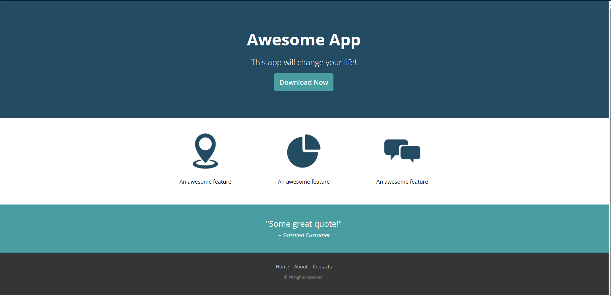

## Overview

- [Overview](The Project "Responsive web design")
  - [Screenshot](./imgs/Screenshot 2024-01-08 113307.png)
  - [Links](https://github.com/Pepo946/Responsive-web-design.git)
- [My process](#my-process)
  - [Built with](Html Css js  jquery )
  - [What I learned](just to make sure that the any page i will have in future need to make it responsive  )
  - [Continued development](more practice in @media response)
  - [Useful resources](https://getbootstrap.com/docs/5.3/examples/)
- [Author => Pepo]

### Screenshot




### Built with

- Semantic HTML5 markup
- CSS custom properties

### What I learned

the easy way to make any page responsive

```js
$(function() {
    $(".btn").click(function() {
        $(".submenu").slideToggle(500);
    });
}); 
```

```js
const proudOfThisFunc = () => {
  console.log('Yayyyyyy , thank you for visiting 🎉')
}
```

### Useful resources

- [Example resource](https://www.tutorialrepublic.com/css-tutorial/) - This helped me for design  and with how to manage Div  reason. I really liked this pattern and will use it going forward.

## Author

- LinkDen - [Pepo](https://www.linkedin.com/in/mohamed-gandoul-53a5ba258/)
- Frontend Mentor - [@Pepo946](https://www.frontendmentor.io/profile/Pepo946)
- Twitter - [@Pepo9461](https://www.twitter.com/yourusername)
